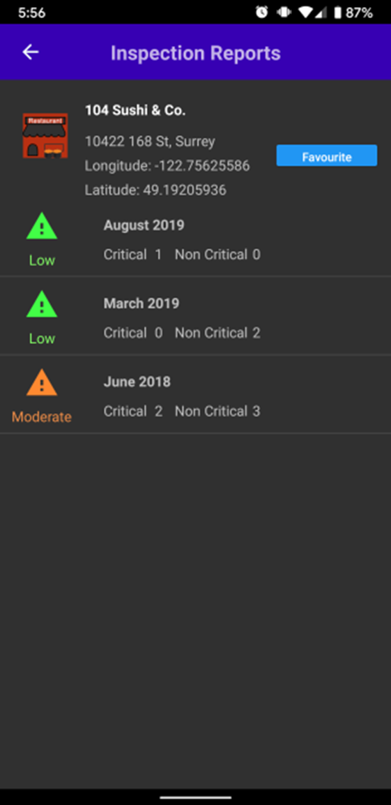

# Restaurant Health Inspection Android App
<p align='center'>
  
</p>

An Andriod app that shows health inspections of restaurants in Surrey, BC Canada.

## Installation
1. Download, install, and run [Android Studios](https://developer.android.com/studio)
2. Click "Get From Version Control"
3. Insert the following URL:
```
git@github.com:Tooo/Restaurant-Health-Inspection-Android.git
```
4. Run app on either an Android Emulator or your phone plugged into your computer

## Features
- Latest restaurant health inspections from Surrey
- Map view with pegs of all restaurants
- Favourite your restaurants and get notified when they get new inspections
- Search for names, hazard level, N critical violations, and favourite restaurants
- Works in both English and French

## Screenshots
<table>
  <tr>
    <td>  </td>
    <td>  </td>
    <td>  </td>
  </tr>
  <tr>
    <td> List of Sample Set </td>
    <td> Inspection Screen </td>
    <td> Violations Screen </td>
  </tr>
</table>

<table>
  <tr>
    <td>  </td>
    <td>  </td>
    <td>  </td>
  </tr>
  <tr>
    <td> Map view of Surrey </td>
    <td> Searching for Pizza </td>
    <td> French view </td>
  </tr>
</table>


## Other
[Project Documentation](docs/Project%20Documentation.pdf)
